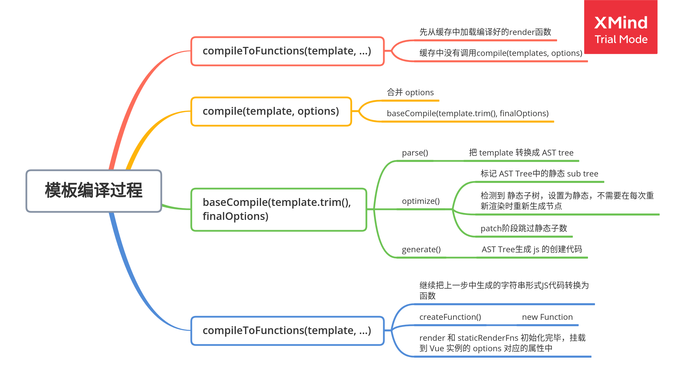
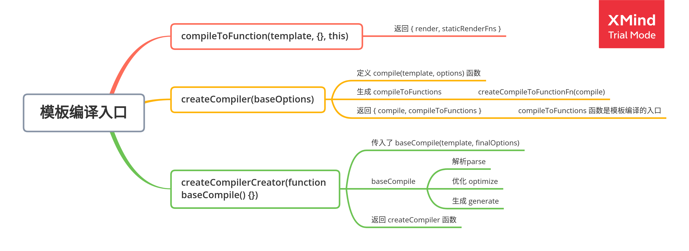

# Vue 模板编译

## 整体流程



## 作用

- Vue2.x使用VNode描述视图以及各种交互，用户自己编写VNode比较复杂
- 用户只需要编写类似HTML的代码-Vue.js模板，通过编译器将模板转换为返回VNode的render函数
- .vue文件会被webpack(+vue-loader)在构建的过程中转换为render函数
- 按转换的时机分为
  - 运行时编译 runtime
  - 构建时编译 默认

## 编译结果

编译前模板

```html
<div id="app">
    <h1>Vue<span>模板编译过程</span></h1>
    <p>{{msg}}</p>
    <comp @myClick="handler"></comp>
</div>

<script src="../../dist/vue.js"></script>
<script>
    Vue.component("comp", {
        template: "<div>I am a comp</div>",
    });

    const vm = new Vue({
        el: "#app",
        data: {
            msg: "Hello Compiler",
        },
        methods: {
            handler() {
                console.log("test");
            },
        },
    });

    console.log(vm.$options.render);
</script>
```

编译后render函数

```js
ƒ anonymous() {
  with(this) {
    return _c(
      'div', 
      { attrs: { "id": "app" } },
      [
        _m(0),  // 静态内容优化处理
        _v(" "),  // 空白文本节点
        _c('p', [ _v(_s(msg)) ]),  // 模板编译的变量转为文本
        _v(" "),
        _c('comp', { on: { "myclick": handler } })  // 创建组件
      ],
      1 // 将children拍平
    )
  }
}
```

编译生成函数的位置：

- _c()
  - `src/core/instance/render.js`
- _m() / _v() / _s()
  - `src/core/instance/render-helpers/index.js`

 _c 与 $createElement q区别在于最后一个参数如何处理children

### 选项的 render 与 template 是怎么选择的？

> platforms/web/entry-runtime-with-compiler.js

先判断是否存在`render`属性，如果没有再取`template`属性，如果再没有，取根节点l`属性

### vue模板渲染缩写的函数参照

```js
export function installRenderHelpers (target: any) {
  target._o = markOnce
  target._n = toNumber
  target._s = toString
  target._l = renderList
  target._t = renderSlot
  target._q = looseEqual
  target._i = looseIndexOf
  target._m = renderStatic
  target._f = resolveFilter
  target._k = checkKeyCodes
  target._b = bindObjectProps
  target._v = createTextVNode
  target._e = createEmptyVNode
  target._u = resolveScopedSlots
  target._g = bindObjectListeners
  target._d = bindDynamicKeys
  target._p = prependModifier
}
```

### 工具

Vue Template Explorer: https://template-explorer.vuejs.org/

AST Explorer: https://astexplorer.net/

### Vue2对比Vue3

Vue2对于标签间的空白和换行会原封不动保存,Vue3则增加空白不会影响render函数。所以vue2中尽量手动去除多余空白以提升编译后的代码质量，vue3则不用。

## 编译的入口函数

compileToFunctions



## 抽象语法树

Abstract Syntax Tree (AST)

- 使用对象的形式描述树形的代码结构
- 此处的抽象语法树是用来描述树形结构的HTML字符串

### 为什么要使用抽象语法树

- 可以通过AST对模板做优化处理
- 标记模板中的静态内容，在patch的时候直接跳过静态内容
- patch过程中的静态内容不需要对比和重新渲染

### Vue AST数据结构

```js
// src/compiler/parser/index.js
export function createASTElement (
  tag: string,
  attrs: Array<ASTAttr>,
  parent: ASTElement | void
): ASTElement {
  return {
    type: 1,
    tag,
    attrsList: attrs,
    attrsMap: makeAttrsMap(attrs),
    rawAttrsMap: {},
    parent,
    children: []
  }
}
```

### parse函数作用

将HTML模板字符串解析为 AST 对象，保存内容、属性、指令(v-for...)到AST对象中。

### optimize函数作用

对抽象语法树左标记静态节点 & 静态根节点的过程。

静态节点：

- node type 是 1
- node是组件 且 不是slot，且 没有inline-template，则不做处理
- 标记 node.static 属性

静态根节点：

- 包含不变的子元素
- 不可以只包含文本元素
- 标记 node.staticRoot 属性

### generate函数作用

> [v-pre](https://cn.vuejs.org/v2/api/#v-pre): 跳过这个元素和它的子元素的编译过程。可以用来显示原始 Mustache 标签

根据AST对象，返回 结果对象

- render: 模板对应的字符串形式的渲染函数代码 `with(this){return ${code}}`
- staticRenderFns: 静态根节点的处理函数

#### 静态根节点如何处理

对于标记了`pre`或者`static`的AST对象，记录节点的 `staticRenderFns`数组，返回`_m(索引)`

_m即 `renderStatic`, 将下标对应的渲染函数执行生成tree，标记为静态

### 将字符串形式代码，转换成函数

```js
res.render = createFunction(compiled.render, fnGenErrors)
res.staticRenderFns = compiled.staticRenderFns.map(code => {
    return createFunction(code, fnGenErrors)
})
```

## 试题错题

关于模板编译描述正确的是：

- 单文件组件template模板是在执行过程中被编译成render函数　X -> 是在构建过程
- 模板和插值表达式在编译的过程中都会被转为对应的代码形式，不会出现在 render 函数中　-> 模板和插值表达式字符串会被编译成代码形式，字符串不会出现在render函数中

关于组件说法，正确的是：

- 在 createElement() 函数中调用createComponent() 函数创建了组件对象 X -> createComponent()返回Vnode。组件对象是在组件init钩子函数中创建，然后在patch()->createElm()->createComponent()中挂在组件。


