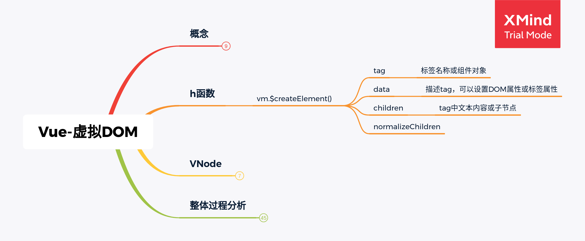
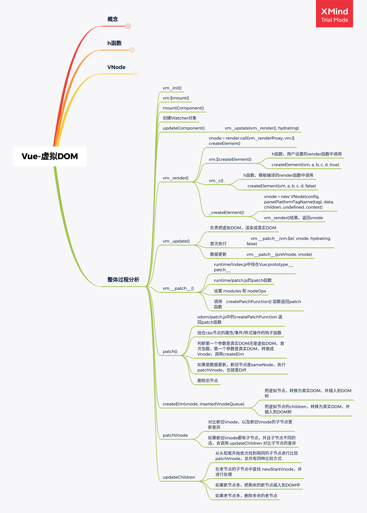

# Vue Virtual DOM部分

## 虚拟DOM

### 什么是虚拟DOM？

使用JavaScript对象描述真实DOM

Vue.js借鉴Snabbdom实现，增加组件和指令

### 为什么使用虚拟DOM？

避免直接操作DOM，提高开发效率

作为一个中间层可以跨平台

虚拟DOM不一定提高性能

- 首次渲染时，需生成Virtual DOM Tree，增加开销
- 复杂试图下提升渲染性能

## h函数

`vm.$createElement(tag, data, children, normalizeChildren)`

- tag
  - 标签名/组件对象
- data
  - 描述tag，可以设置DOM属性或者标签的属性
- children
  - tag中的文本内容或者子节点



## Vnode

VNode核心属性

- tag
- data
- children
- text
- elm
- key

## 整体过程分析



### patch函数

#### 初始化

> src/platforms/web/runtime/index.js

```
Vue.prototype.__patch__ = inBrowser ? patch : noop
```


> src/platforms/web/runtime/patch.js

```
export const patch: Function = createPatchFunction({ nodeOps, modules })
```

- node-ops.js: 操作DOM的API
- modules: 包含 
  - baseModules：导出directives和ref
  - webPlatformModules: 导出attrs, class等dom模块


> src/core/vdom/patch.js

createPatchFunction 是与平台无关的高阶函数，传入模块和节点操作API，返回patch函数。

#### createElement

把vnode转为真实DOM，挂在到DOM上

#### patchVnode()

- 执行用户自定义的 `prepatch`钩子函数
- 执行模块 + 用户自定义的`update`钩子函数

- 判断新旧节点对比情况
  - 如果新节点没有文本
    - 如果新老节点都存在子节点：`updateChildren`
    - 如果新节点有子节点，老节点无，即要插入新子节点
      - 先清空老节点的DOM文本内容
      - 为当前DOM插入新的子节点
    - 如果老节点有子节点，新的无，即要删除当前DOM的子节点：`removeVnodes`
    - 如果老节点有文本节点，新的没有，即删除文本节点：`setTextContent(elm, '')`
  - 如果新老节点都有文本，且不一致，即更新文本内容：`setTextContent(elm, vnode.text)`
- 执行用户传入的`postpatch` 钩子

#### updateChildren

整体流程：

- 检查新vnode节点有无重复key
- diff算法，循环更新新旧子节点
- 如果循环结束
  - 新节点比旧节点多，将剩余节点插到老结束节点后面
  - 旧节点比新节点多，批量删除多余节点


diff 算法，更新新旧节点的子节点

- 遍历新旧子节点：

  - 如果　oldStartVnode 不存在，oldStartIdx +1，结束本次循环
  - 如果　oldEndVnode 不存在，oldEndIdx - 1，结束本次循环
  - 如果　oldStartVnode 与　newStartVnode 是 sameVnode
    - patchVnode
    - newStartIdx +1
    - oldStartIdx + 1
    - 结束本次循环
  - 如果　oldEndVnode 与　newEndVnode 是 sameVnode
    - patchVnode
    - oldEndIdx -1
    - newEndIdx -1
    - 结束本次循环

  - 如果　oldStartVnode 与　newEndVnode 是 sameVnode
    - patchVnode
    - 将　oldStartVnode 的DOM　插入到　oldStartVnode 前
    - oldStartIdx +1
    - newEndIdx - 1
    - 结束本次循环

  - 如果　oldEndVnode 与　newStartVnode 是 sameVnode

    - patchVnode
    - 将　oldEndVnode 的DOM　插入到　oldEndVnode 后
    - oldEndIdx -1
    - newStartIdx + 1
    - 结束本次循环

  - 如果都不满足，newStartVnode　依次和旧节点比较

    -  如果　newStartVnode 的 key，在旧子节点中找不到相同的
      - 依据newStartVnode创建新的DOM，插到　oldStartVnode DOM 前

    - 如果在旧子节点中找到key相同的节点
      - 如果　tag也相同，
        - 执行　patchVnode
        - 将旧节点 DOM 移动到oldStartVnode DOM 前
      - 否则当作新节点处理,创建新的DOM，插到　oldStartVnode DOM 前
    - newStartIdx +1
    - 结束本次循环

### key的作用

设置了key，会走diff算法，重用新旧节点中的相同节点，DOM操作会减少，性能更优。